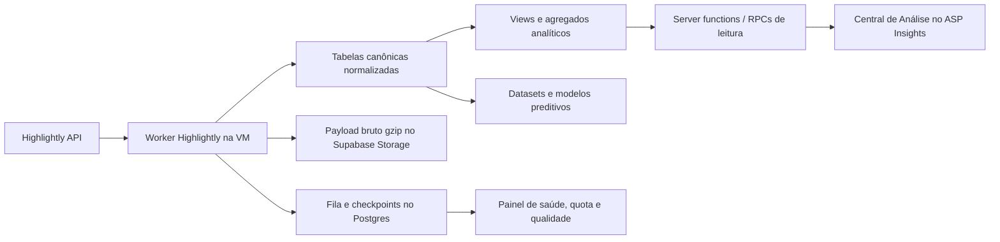

# Plano de implantação — Central de Análise Esportiva Highlightly

Data: 14/07/2026
Projeto: ASP Insights
Status: plano proposto para aprovação

## 1. Objetivo

Transformar o ASP Insights em uma plataforma própria de dados e análise esportiva, utilizando a Highlightly como fonte primária inicial e preservando todos os recursos fornecidos pela API:

- partidas, calendários, estados e placares;
- países, ligas, temporadas, rodadas, times e jogadores;
- estatísticas de time, partida e jogador;
- escalações, box scores e eventos;
- standings, últimos jogos e confrontos diretos;
- bookmakers, odds prematch e live;
- highlights e demais recursos específicos de cada esporte;
- payload bruto e metadados da coleta para auditoria e reprocessamento.

A experiência será inspirada no fluxo de trabalho mostrado nas referências do Packball: lista densa de jogos, comparação horizontal e detalhe lateral contextual. A identidade visual e os componentes serão próprios do ASP Insights.

## 2. Escopo recomendado

### V1 operacional

Cobertura completa dos três esportes já investigados:

1. Football;
2. Baseball, com foco inicial em MLB;
3. Basketball global, com foco inicial em WNBA.

“Completa” significa importar todo recurso e todo campo retornado pela Highlightly para esses módulos, mesmo que nem toda estatística apareça por padrão na interface.

### Expansão V2

A arquitetura será genérica desde o início para receber os outros módulos documentados: NBA/NCAAB, NFL/NCAA, NHL/NCAAH, cricket, handball, rugby e volleyball. A ativação ocorrerá esporte por esporte depois de validar cobertura, quota e custo de armazenamento.

## 3. Decisões estruturais

1. A chave Highlightly ficará apenas na VM, em variável `HIGHLIGHTLY_API_KEY`; nunca no frontend, banco, logs ou payloads.
2. A VM atual do `asp-scraper-api` será o ambiente do coletor. O FastAPI servirá para controle/observabilidade, não para executar polling longo dentro de uma requisição web.
3. O frontend continuará no aplicativo atual: React 19, TanStack Start/Router, TanStack Query, Tailwind, Radix, Recharts e Supabase.
4. A Highlightly será tratada como provider, não como modelo de domínio. As tabelas canônicas terão nomes independentes do fornecedor, permitindo outras fontes no futuro.
5. Todo payload será preservado em formato bruto comprimido e também normalizado.
6. Estatísticas desconhecidas ou novas nunca serão descartadas. Serão registradas automaticamente no catálogo de métricas e marcadas para revisão.
7. Odds serão versionadas somente quando o preço ou estado mudar, evitando milhões de linhas idênticas.
8. Nenhum recurso da nova central alterará prognósticos, bankroll ou publicação durante o período shadow.

## 4. Arquitetura-alvo



### Camada bruta

Responsável por fidelidade e reprocessamento:

- bucket privado `highlightly-raw`;
- arquivos `json.gz` organizados por `sport/resource/date/run/page`;
- hash SHA-256, status HTTP, parâmetros, paginação, plano e horário da coleta;
- redaction obrigatória de headers e credenciais;
- retenção configurável por tipo de recurso.

### Camada canônica

Responsável por joins, filtros e histórico:

- entidades com IDs internos e IDs externos;
- facts de partidas, estatísticas, eventos, escalações e odds;
- timestamps com timezone;
- números e percentuais em tipos consistentes;
- constraints e chaves de idempotência.

### Camada de leitura/analytics

Responsável pela velocidade da interface e dos modelos:

- resumo diário de partidas;
- forma de times por janela;
- comparativo mandante × visitante;
- consenso e movimento de odds;
- standings atuais e snapshots;
- cobertura e freshness por recurso.

## 5. Modelo de dados proposto

### Controle de ingestão

| Tabela | Responsabilidade |
|---|---|
| `hl_ingestion_jobs` | Fila, prioridade, tentativas, cursor, horário previsto e lock |
| `hl_ingestion_runs` | Uma execução de endpoint/página, duração, status e quota |
| `hl_raw_objects` | Referência ao arquivo bruto no Storage, hash e schema fingerprint |
| `hl_rate_limit_usage` | Limite, saldo e consumo observado por chamada |
| `hl_data_quality_issues` | Corrupções, campos ausentes, odds inválidas e schema drift |
| `hl_metric_definitions` | Catálogo dinâmico de toda estatística observada |

### Entidades canônicas

| Tabela | Grão |
|---|---|
| `sports_providers` | fornecedor |
| `sports_provider_entities` | mapeamento provider + tipo + ID externo → ID interno |
| `sports` | esporte |
| `sports_countries` | país |
| `sports_competitions` | liga/competição |
| `sports_seasons` | competição + temporada |
| `sports_teams` | time/franquia |
| `sports_players` | jogador |
| `sports_bookmakers` | bookmaker canônico e aliases |
| `sports_matches` | uma partida |
| `sports_match_participants` | partida + time + papel home/away |
| `sports_match_period_scores` | partida + período + time |

### Dados esportivos

| Tabela | Grão |
|---|---|
| `sports_match_team_stats` | partida + time + métrica |
| `sports_team_season_stats` | time + liga + temporada + split + métrica |
| `sports_player_stats` | jogador + escopo/temporada + métrica |
| `sports_player_box_scores` | partida + jogador + métrica |
| `sports_lineups` | partida + time + versão da escalação |
| `sports_lineup_players` | escalação + jogador + titular/reserva/posição |
| `sports_match_events` | partida + sequência/timestamp do evento |
| `sports_standings_snapshots` | competição + temporada + grupo + time + instante |
| `sports_highlights` | partida + highlight |

### Odds

| Tabela | Grão |
|---|---|
| `sports_market_definitions` | mercado canônico, linha e regra de settlement |
| `sports_odds_current` | última cotação por partida/mercado/seleção/bookmaker |
| `sports_odds_history` | somente mudanças de odd/status ao longo do tempo |
| `sports_odds_consensus` | mediana, melhor odd, IQR e número de bookmakers por snapshot |

`sports_odds_history` deverá ser particionada por mês quando a projeção ou o volume real justificar. Com o volume observado, essa decisão deve ser preparada desde a migration inicial. As consultas usarão cursor/keyset, nunca paginação profunda por `OFFSET`.

### Estratégia para todas as estatísticas

Não serão criadas 1.200 colunas. Cada métrica ficará em formato longo:

```text
match_id, team_id, metric_definition_id,
numeric_value, text_value, unit, period, collected_at
```

O catálogo `hl_metric_definitions` conterá:

```text
sport, resource, provider_key, canonical_key,
display_name, group_name, value_type, unit,
aggregation, direction, status, first_seen_at, last_seen_at
```

As métricas de uso frequente serão expostas em views/materialized views próprias. Isso preserva tudo sem sacrificar performance.

## 6. Catálogo de recursos e cadência

| Grupo | Recursos | Cadência inicial |
|---|---|---|
| Catálogos | países, ligas, times, bookmakers | diária; semanal para catálogos estáveis |
| Temporadas | standings, team season stats | diária e após rodada |
| Partidas futuras | matches D-7 até D+1 | 30 min; 10 min no dia do jogo |
| Lineups | escalações/rosters | T-24h, T-2h, T-30m e kickoff |
| Prematch odds | todos os mercados/bookmakers | 60 min entre D-7 e T-24h; 15 min até kickoff |
| Live | estado, score, events e odds live | somente partidas ativas; respeitar atualização real do provider |
| Pós-jogo | statistics, box score, events e highlights | final +15m, +2h e +24h |
| Jogadores | perfil e estatísticas de temporada | semanal e sob demanda |
| Last five/H2H | cache inicial; depois derivado internamente | sob demanda com TTL, sem polling massivo |
| Backfill | temporadas/datas históricas | janela noturna com orçamento próprio |

Cada endpoint terá um registro de configuração declarativo:

```text
sport, resource, path_template, parameters,
cadence, priority, paginator, normalizer,
target_table, retry_policy, freshness_sla
```

## 7. Orçamento da conta PRO

Limite confirmado: 7.500 chamadas/dia.

Divisão inicial:

| Uso | Percentual | Chamadas/dia |
|---|---:|---:|
| Polling programado | 60% | 4.500 |
| Pós-jogo e backfill | 20% | 1.500 |
| Retries e recuperação | 10% | 750 |
| Reserva operacional/manual | 10% | 750 |

O worker deverá:

- registrar `x-ratelimit-requests-limit` e `remaining` em toda chamada;
- reduzir automaticamente cadências quando o saldo projetado ameaçar a reserva;
- priorizar partidas ativas, fechamento prematch e pós-jogo;
- pausar backfill antes de afetar dados atuais;
- impedir execução duplicada por advisory lock/job claim;
- alertar em 25%, 15% e 10% de saldo.

Antes de ativar todos os esportes será obrigatório medir o fator real de paginação. A quantidade de partidas não representa diretamente a quantidade de chamadas.

## 8. Worker e operação na VM

Nova estrutura, sem aumentar o monólito `api/main.py`:

```text
api/highlightly/
  routes.py
  scheduler.py
  worker.py
  endpoint_registry.py
  repositories.py
  storage.py
  quality.py
  normalizers/
    common.py
    football.py
    baseball.py
    basketball.py
```

Fluxo do worker:

1. um timer `systemd` executa o dispatcher a cada minuto;
2. o dispatcher cria jobs vencidos conforme o registry;
3. workers reivindicam jobs com lock e `SKIP LOCKED`;
4. o cliente consulta a API com timeout, retry exponencial e jitter;
5. o bruto é redigido, comprimido e enviado ao Storage;
6. normalizadores fazem upsert em lotes;
7. guardrails classificam ou colocam o payload em quarentena;
8. views/read models são atualizados de forma incremental;
9. o run registra contagem, latência, quota e resultado.

Endpoints administrativos no FastAPI:

- `GET /highlightly/health`;
- `GET /highlightly/quota`;
- `GET /highlightly/jobs`;
- `POST /highlightly/jobs` para execução manual controlada;
- `POST /highlightly/backfill`;
- `POST /highlightly/reprocess/{raw_object_id}`;
- `GET /highlightly/quality/issues`.

Todos continuarão protegidos pelo proxy server-side e por autenticação administrativa.

## 9. Experiência da Central de Análise

### Rota e navegação

Nova rota autenticada: `/central-esportiva`.

Novo item no menu “Dados e modelos”: **Central Esportiva**. A rota será protegida inicialmente por feature flag `highlightly_analysis_enabled`.

### Tela principal — explorador de partidas

Estrutura desktop:

1. toolbar fixa com esporte, data, ao vivo, favoritos, ligas, busca e freshness;
2. rail compacto de ligas/favoritos, recolhível;
3. grade virtualizada de partidas com horário/time fixos e colunas analíticas horizontais;
4. presets de colunas por esporte e mercado;
5. painel lateral redimensionável ao selecionar uma partida;
6. estado da seleção preservado na URL para compartilhamento/retorno.

Presets Football:

- Geral/forma;
- Gols e xG;
- 1X2/BTTS;
- Cantos;
- Handicap;
- Disciplina;
- Odds e movimento.

Presets MLB:

- Geral/forma;
- Ataque;
- Starting pitchers;
- Bullpen;
- Moneyline/run line;
- Totais;
- Odds e movimento.

Presets WNBA:

- Geral/forma;
- Eficiência e pace;
- Arremessos;
- Rebotes/turnovers;
- Moneyline/spread;
- Totais;
- Odds e movimento.

### Painel de detalhe da partida

Abas propostas:

1. **Resumo:** placar/horário, contexto e comparação principal;
2. **Odds:** mediana, melhor preço, bookmakers e gráfico de movimento;
3. **Estatísticas:** todas as métricas agrupadas, com busca e seletor de janela;
4. **Forma:** últimos jogos, tendências e splits casa/fora;
5. **Lineups/Jogadores:** titulares, banco e métricas individuais quando suportado;
6. **Eventos/Box score:** timeline e detalhe pós-jogo;
7. **Standings/H2H:** classificação validada e confrontos;
8. **Análise ASP:** previsões, probabilidades, edge e alertas de qualidade;
9. **Fonte:** freshness, cobertura, IDs e issues para auditoria administrativa.

### Visualizações

- linhas de forma recente;
- barras divergentes mandante × visitante;
- distribuição prevista de placar/total/margem;
- evolução de odds por bookmaker e mediana;
- tabelas de box score e lineup;
- heatmap discreto nas células da grade;
- semáforos apenas quando houver regra semântica documentada.

Não serão usados gráficos decorativos. Cada visual deverá responder a uma pergunta operacional.

### Responsividade

- desktop: grade + painel lateral;
- tablet: grade compacta + drawer de detalhe;
- mobile: lista compacta por competição e detalhe em tela cheia;
- colunas analíticas serão presets selecionáveis, não uma tabela horizontal impossível de usar no celular.

### Performance do frontend

- TanStack Query com chaves por esporte/data/filtro;
- RPC/server function que retorna um read model compacto, sem N+1;
- cursor pagination e virtualização de linhas/colunas;
- `useDeferredValue` para busca/filtros caros;
- carregamento paralelo de recursos independentes;
- dynamic import das abas e gráficos pesados;
- renderização do painel de detalhe somente após seleção;
- cache/freshness explícitos na interface.

## 10. Plano de execução por fases

### Fase 0 — contrato e segurança

Duração estimada: 2–3 dias.

Entregáveis:

- congelar o OpenAPI 6.13.2 como contrato inicial;
- registry de endpoints e matriz de suporte por esporte;
- política de retenção do bruto;
- convenções de IDs, datas, unidades e metric keys;
- secrets na VM e checklist de rotação da chave;
- feature flag criada e desligada.

Aceite:

- nenhum segredo no Git/frontend;
- todo endpoint dos três módulos possui owner, cadência e destino;
- plano de quota aprovado.

### Fase 1 — fundação de dados

Duração estimada: 5–7 dias.

Entregáveis:

- migrations aditivas das tabelas de ingestão, catálogo e entidades;
- bucket privado e políticas;
- constraints, RLS e índices compostos;
- job queue, locks, retries e idempotência;
- catálogo dinâmico de métricas;
- testes de migration e rollback lógico.

Aceite:

- upsert repetido não cria duplicata;
- usuário não administrador não lê dados internos;
- bruto pode ser reprocessado sem consultar novamente a API.

### Fase 2 — vertical slice Football

Duração estimada: 7–10 dias.

Entregáveis:

- países, ligas, times, partidas e bookmakers;
- odds current/history/consensus;
- statistics, lineups, events, box score, players, standings, last five, H2H e highlights;
- read model da lista diária e detalhe;
- guardrails de standings/odds/schema drift;
- backfill controlado de 30 dias.

Aceite:

- uma partida de futebol pode ser explorada ponta a ponta;
- todas as 40 métricas observadas são preservadas e consultáveis;
- IDs e paginação reconciliados;
- odds atuais e histórico de mudança disponíveis.

### Fase 3 — MLB

Duração estimada: 6–9 dias.

Entregáveis:

- normalizadores de 171 métricas de partida;
- lineups com identificação de starting pitcher;
- box scores/jogadores;
- standings, forma e read models MLB;
- presets de ataque, pitching, bullpen e defesa.

Aceite:

- todas as métricas retornadas ficam pesquisáveis por grupo;
- starter e lineup têm status de confirmação;
- Moneyline, total e run line exibem odds e movimento;
- a mediana é publicada quando a mesma seleção/linha possui 2–7 bookmakers preferidos, sempre acompanhada da quantidade de fontes.

Estado em 15/07/2026: implementação, migrations e validação operacional concluídas. Dois shadows reais confirmaram 171 métricas por equipe, lineups/starting pitchers, eventos, box scores e histórico de odds. A regra global foi ajustada para publicar consenso com 2–7 bookmakers preferidos e aplicada ao banco ativo. O recálculo sem consumo de cota gerou 20 consensos no All-Star Game e 38 em Dodgers × Diamondbacks, com 10 Run Lines em cada partida. Provider e feature flag permanecem desligados; backfill ainda não foi iniciado. Ver `docs/highlightly/phase-3-mlb-vertical-slice.md`.

### Fase 4 — WNBA

Duração estimada: 5–7 dias.

Entregáveis:

- team stats, match stats, standings e forma;
- 21 métricas brutas e métricas derivadas de eficiência;
- read models WNBA;
- guardrail obrigatório contra corrupção de standings.

Aceite:

- standings corrompido nunca aparece como válido;
- Pace, ORtg, DRtg, eFG%, TS% e Net Rating são reproduzíveis;
- Moneyline, total e spread exibem consenso e movimento.

Estado em 15/07/2026: implementação, migration, smoke e shadow operacional concluídos. A vertical cobre as 19 operações Basketball, 21 métricas brutas, seis eficiências reproduzíveis, odds e read models admin-only. O shadow da partida `421203234` produziu 54 fatos de equipe, 1.000 odds atuais, 1.000 movimentos e 125 consensos. O guardrail rejeitou as 30 posições do caso real de identidade repetida (`Panevezys Women`) antes de poluir times ou standings canônicos. Fila zerada, provider e feature flag desligados; nenhum backfill iniciado. Ver `docs/highlightly/phase-4-wnba-vertical-slice.md`.

### Fase 5 — design de produto

Duração estimada: 4–6 dias.

Entregáveis:

- conceito visual completo gerado a partir do design system ASP;
- tela desktop principal, detalhe aberto e estado mobile;
- tokens, tipografia, iconografia, densidade e anatomia das células;
- inventário de componentes e interações;
- aprovação visual antes de programar a interface.

Aceite:

- conceito preserva velocidade da grade e clareza do detalhe;
- não copia marca, assets ou composição literal do Packball;
- estados desktop/tablet/mobile estão definidos.

### Fase 6 — frontend da Central

Duração estimada: 10–15 dias.

Entregáveis:

- rota, menu e feature flag;
- toolbar, filtros, favoritos e presets;
- grade virtualizada;
- painel/drawer de detalhe com abas;
- charts, odds movement, tables e estados vazios/erro/stale;
- instrumentação de uso e performance.

Aceite:

- fluxo esporte → data → partida → detalhe funciona;
- filtros respondem sem travar;
- 1.000 partidas/linhas podem ser navegadas sem renderização integral;
- QA visual contra o conceito aprovado em desktop e mobile.

### Fase 7 — backfill, QA e shadow

Estado em 15/07/2026: fundação de observabilidade, reconciliação, quota ceiling e executor
progressivo implementada localmente. Migration e smoke aguardam aplicação no backend Lovable; a
janela real de sete dias ainda não foi iniciada e o provider permanece desligado. Ver
`docs/highlightly/phase-7-backfill-shadow-runbook.md`.

Duração estimada: 7–10 dias.

Entregáveis:

- backfill progressivo por data/liga;
- reconciliação de cobertura;
- load tests, EXPLAIN e ajuste de índices;
- observabilidade e alertas;
- comparação Highlightly × fontes atuais;
- runbook operacional.

Aceite:

- 7 dias contínuos sem perda de job não recuperada;
- consumo abaixo do budget e reserva preservada;
- freshness e cobertura dentro do SLA;
- nenhuma regressão em prognósticos/bankroll/publicação.

### Fase 8 — ativação e expansão

Duração estimada: 3–5 dias para ativação; expansão contínua.

Entregáveis:

- habilitação somente para administradores;
- rollout gradual por esporte;
- definição do primeiro uso pelos modelos;
- backlog dos demais módulos Highlightly.

Aceite:

- rollback por feature flag;
- dados históricos e atuais reconciliados;
- monitoramento diário de quota, freshness e issues ativo.

## 11. Cronograma consolidado

Estimativa para uma pessoa sênior trabalhando de forma contínua: **8–11 semanas**. Com backend/data e frontend trabalhando em paralelo após o contrato da Fase 1: **5–7 semanas**.

Ordem crítica:

```text
Contrato → Banco/worker → Football vertical → MLB/WNBA
         → conceito aprovado → frontend → shadow → ativação
```

Não se deve construir a grade definitiva antes de o read model Football estar estável. Caso contrário, o frontend será acoplado aos payloads brutos e precisará ser refeito.

## 12. Testes obrigatórios

### Ingestão

- contrato de URL/params por endpoint;
- paginação completa;
- retry 429/5xx/timeout;
- idempotência e concorrência;
- quota e degradação adaptativa;
- reprocessamento do bruto;
- schema drift e métrica desconhecida.

### Dados

- foreign keys e mappings canônicos;
- percentuais/unidades;
- duplicatas e nulos;
- standings repetidos/incorretos;
- odds `<= 1.00`;
- pares incompletos;
- timestamps fora de ordem;
- recursos indisponíveis por esporte sem falsos erros.

### Frontend

- filtros e URL state;
- seleção de partida e abas;
- virtualização e navegação por teclado;
- charts e tabelas reconciliados;
- loading/empty/error/stale;
- desktop, tablet e mobile;
- acessibilidade, foco e contraste;
- sessão expirada e RLS.

### Performance

- lista inicial p75 menor que 2 segundos com cache quente;
- troca de filtro percebida menor que 200 ms quando local;
- detalhe principal menor que 1,5 segundo;
- queries críticas com index/bitmap scan esperado;
- nenhuma query N+1 por partida;
- bundle de charts/detalhes carregado sob demanda.

## 13. SLAs e indicadores da nova plataforma

| Indicador | Meta inicial |
|---|---:|
| Partidas-alvo importadas | ≥ 98% |
| Partidas finalizadas com stats suportadas | ≥ 95% |
| Duplicatas canônicas | 0 |
| Odds inválidas servidas à UI | 0 |
| Freshness prematch | ≤ 20 min |
| Freshness live odds | compatível com atualização de 10 min do provider |
| Jobs recuperados após falha | 100% |
| Reserva diária de quota | ≥ 10% |
| Métricas novas descartadas | 0 |

## 14. Riscos e mitigação

| Risco | Mitigação |
|---|---|
| Quota insuficiente | scheduler adaptativo, prioridades, cache e PRO→ULTRA somente com evidência |
| Payload muda sem aviso | schema fingerprint, raw retention e métrica unknown |
| Corrupção silenciosa | guardrails e quarentena antes da camada de leitura |
| Explosão de odds | armazenar só mudanças; current/history separados; particionamento |
| Frontend lento | read models, virtualização, cursor e lazy loading |
| Dependência da Highlightly | modelo canônico provider-agnostic e raw reprocessável |
| Sem staging separado | migrations aditivas pequenas, ambiente local, feature flag e shadow |
| Logos/imagens/licenças | revisar termos antes de exibição externa; não assumir direito de redistribuição |
| Recursos não suportados em um esporte | capability matrix; interface oculta abas sem dados |
| Backfill consumir produção | fila de baixa prioridade, janela noturna e budget próprio |

## 15. Primeira sequência de tickets

1. `HL-001` — endpoint registry dos três esportes;
2. `HL-002` — secrets e rotação da chave na VM;
3. `HL-003` — migrations de ingestão e catálogo;
4. `HL-004` — bucket privado e raw writer gzip;
5. `HL-005` — job queue, locks, quota e retries;
6. `HL-006` — normalização de catálogos e mappings;
7. `HL-007` — matches Football com paginação completa;
8. `HL-008` — stats/events/lineups/box score Football;
9. `HL-009` — odds current/history/consensus;
10. `HL-010` — read model Football diário;
11. `HL-011` — painel administrativo de qualidade/quota;
12. `HL-012` — conceito visual desktop/detalhe/mobile;
13. `HL-013` — grade virtualizada e filtros;
14. `HL-014` — detalhe Football;
15. `HL-015` — normalizadores e UI MLB;
16. `HL-016` — normalizadores e UI WNBA;
17. `HL-017` — backfill e reconciliação;
18. `HL-018` — shadow de sete dias e gate de ativação.

## 16. Definition of Done da V1

A V1 estará concluída somente quando:

- todos os recursos disponíveis de Football, MLB e WNBA estiverem inventariados e persistidos;
- todo campo retornado estiver no bruto e todo valor estatístico estiver no catálogo dinâmico;
- a lista diária, filtros e detalhe funcionarem com dados reais;
- odds atuais, histórico e consenso forem auditáveis;
- dados inválidos não chegarem às views públicas;
- coleta automática sobreviver a restart e recuperar jobs;
- quota e freshness estiverem visíveis;
- QA visual e funcional passar em desktop e mobile;
- sete dias de shadow forem concluídos sem regressão operacional;
- a ativação puder ser desfeita por feature flag.
